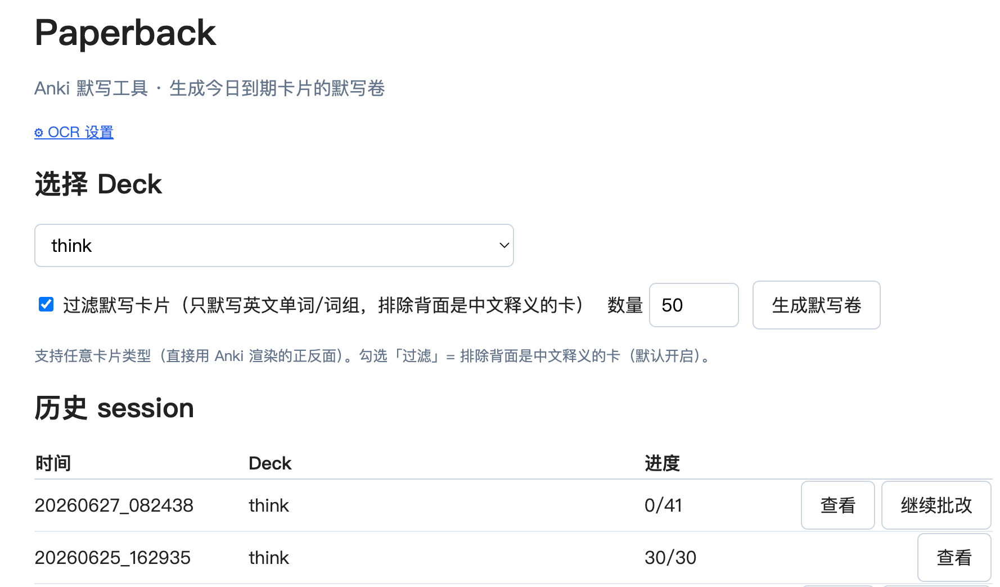
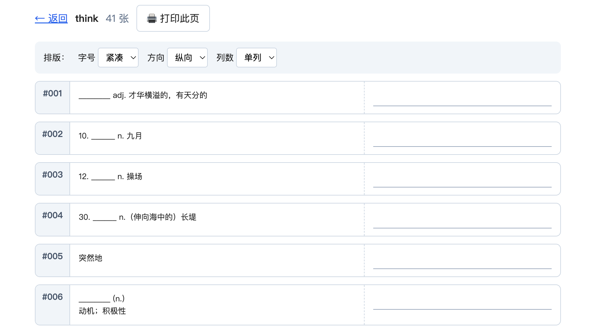
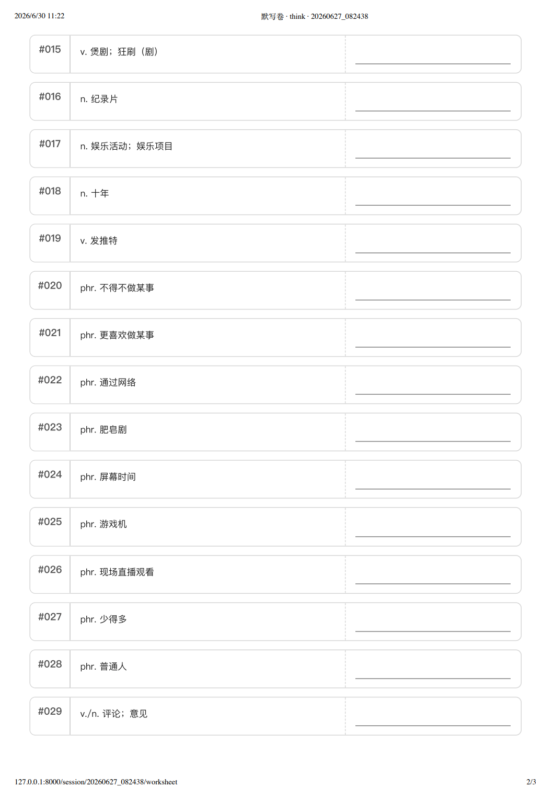
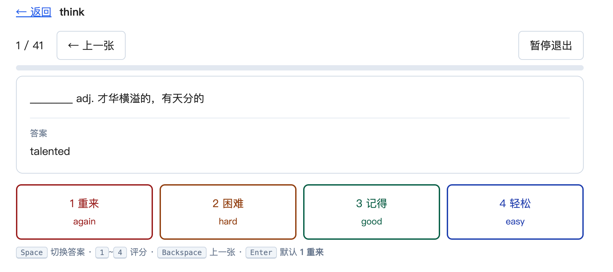

# Paperback · Anki 默写本

> [中文](README.md) | [English](README.en.md)

基于 Anki 的纸笔默写工具：取今日到期卡片 → 生成可打印默写卷 → 纸笔默写 → 批改（手动或拍照 OCR）→ 评分写回 Anki 调度。

把「看屏幕刷卡片」变成「纸笔默写 + 评分回流」——用更费力的主动回忆巩固记忆。

## 特点

- **任意 note type 通用**：直接用 Anki 已渲染的正反面，Basic / Basic reversed / Cloze / 自定义模板都支持
- **默写卷可打印**：左正面右填空，A4 版面；字号 / 方向 / 单双列可调，**按 deck 记忆排版偏好**
- **两种批改模式**：
  - 手动：键盘 1–4 评分，`Space` 切换答案（推荐）
  - 拍照 OCR（⚠️ 测试中，暂不推荐）：手机拍默写卷上传，GLM 视觉识别 + 自动建议档位
- **配置全在网页**：OCR 的 provider/key/model 在 `/settings` 页配，存本地，**立即生效无需重启**
- **复用 Anki 调度**：不重新设计算法，默写结果翻译成 4 档 ease 喂给 SM-2
- **本机工具**：仅监听 127.0.0.1，无认证，数据在 `~/.paperback/`

## 截图速览

**首页** — 选 deck + 数量，历史 session 一目了然


**默写卷** — 打印纸笔默写，排版可调（字号 / 方向 / 单双列）


**默写卷（打印效果）** — 实际打印 / 存 PDF 的纸面样子


**手动批改** — 键盘 1–4 评分，`Space` 切换答案


## 前置要求

1. **Anki 桌面版**运行中
2. 已装 **[AnkiConnect](https://ankiweb.net/shared/info/2055492159)** 插件（默认端口 8765）
3. Python 3.10+（uv 自动获取）

## 快速开始

```bash
uv sync
uv run paperback          # 监听 http://127.0.0.1:8000
```

浏览器打开 <http://127.0.0.1:8000>

## 使用流程

1. **首页**选 deck + 数量（可勾选「过滤默写卡片」排除背面是中文释义的卡）→ 生成。deck / 过滤 / 数量会记住，下次自动恢复；首页还有历史 session 列表可继续批改。
2. **session 页**：
   - 打印「📄 默写卷」，在纸上默写（顶部可调字号/方向/单双列，按 deck 记忆）
   - 需要时打印「答案卷」对照
3. **批改**：
   - **手动**（推荐）：「开始批改」→ `Space` 显示答案 → `1`–`4` 评分（`Enter` 默认 **1 重来**，`Backspace` 上一张）
   - **拍照 OCR**（⚠️ 测试中，暂不推荐）：「📸 拍照批改」→ 手机拍照上传 → GLM 识别 + 建议档位 → 确认后写回（需先在 `/settings` 配置；详见 [PHOTO_GRADING.md](PHOTO_GRADING.md)）
4. 评分实时写回 Anki；网络中断会缓存待补交，恢复后一键重试

## 支持的卡片类型

直接用 AnkiConnect 已渲染的 `question`/`answer`，**支持任意 note type**：

| 类型 | 支持 | 说明 |
|---|---|---|
| Basic / Basic (and reversed card) | ✅ | 正反向卡都正确 |
| Cloze | ✅ | 自定义挖空：默写卷下划线、答案卷高亮 |
| 自定义模板（单词 deck 等） | ✅ | 只要 Anki 能渲染正反面即可 |
| Image Occlusion 等图片型 | ✅ 技术上支持 | 遮挡类是否适合默写由用户判断 |

> 极少数正面渲染为空的卡生成时跳过并在概览页提示。卡片图片自动 base64 内嵌，独立浏览器可正常显示。

## 评分档位

| 键 | 档 | Anki ease |
|---|---|---|
| `1` | 重来 again | 1 |
| `2` | 困难 hard | 2 |
| `3` | 记得 good | 3 |
| `4` | 轻松 easy | 4 |

默认 = **1 重来**（严格模式：除非主动确认，否则按"不会"处理）。

## 拍照批改（OCR，⚠️ 测试中，暂不推荐）

> ⚠️ 此功能仍在测试，**不推荐日常使用**。手动批改更可靠。

手机拍默写卷上传 → GLM 视觉识别 + 建议档位 → 确认写回（配置在 `/settings` 页）。

详细说明、模型选型对比、配置与隐私见 **[PHOTO_GRADING.md](PHOTO_GRADING.md)**。

## 安全性

- 仅监听 `127.0.0.1`，不暴露网络
- 批改前校验 Anki 当前 profile/deck 与生成时一致，不一致拦截（防写错 profile）
- session 文件原子写 + 进程内锁，防多页签并发覆盖

## 配置

OCR 走 `/settings` 网页页（推荐）。其他走环境变量：

| 变量 | 默认值 | 说明 |
|---|---|---|
| `PAPERBACK_ANKI_URL` | `http://localhost:8765` | AnkiConnect 地址 |
| `PAPERBACK_DATA_DIR` | `~/.paperback/sessions` | session 存储目录 |
| `PAPERBACK_OCR_API_KEY` | （无） | OCR：视觉 LLM 的 key（推荐走 `/settings` 页）|
| `PAPERBACK_OCR_BASE_URL` | `https://open.bigmodel.cn/api/paas/v4` | OpenAI 兼容端点（默认 GLM） |
| `PAPERBACK_OCR_MODEL` | `glm-5v-turbo` | 视觉模型名 |
| `PAPERBACK_OCR_MAX_IMAGE_PX` | `2000` | 上传前长边压缩阈值 |
| `PAPERBACK_OCR_RETAIN_DAYS` | `365` | 原图本地留存天数（启动自动清理） |

## 重启后恢复

代码 / 依赖 / session 数据都在磁盘。重启两步：

1. 启动 **Anki 桌面版**，打开 profile（确认 AnkiConnect 在 8765）
2. 启动 **Paperback**：
   ```bash
   uv run paperback          # http://127.0.0.1:8000
   ```

## 测试

```bash
uv run pytest          # 59 passed
```

## FAQ

**首页提示「无法连接 AnkiConnect」？**
- 确认 Anki 桌面版正在运行，并装了 [AnkiConnect](https://ankiweb.net/shared/info/2055492159) 插件（默认端口 8765）
- 确认已打开一个 profile（不能停在 Anki 的 profile 选择器）

**生成时「没有到期卡片」？**
- Paperback 只取**今日到期**的卡（`is:due`：到期 review + 当天 new + learning 步进）
- 当天确实没到期卡就空——换 deck 或明天再来
- 若勾了「过滤默写卡片」可能把卡过滤光（排除背面是中文释义的卡），试试取消勾选

**拍照批改用不了 / OCR key 哪里申请？**
- 智谱开放平台 open.bigmodel.cn 注册 → 创建 API key
- 在首页「⚙ OCR 设置」填 key（不用命令行 export）
- ⚠️ OCR 是测试功能，**不推荐日常使用**，手动批改更可靠

**卡片图片显示空白 / 裂图？**
- Paperback 已把 Anki media 图片 base64 内嵌，正常应显示
- 仍空白通常是 Anki 里 media 文件本身缺失（用 Anki 的「检查媒体」工具修复）
- 远程图片（`http(s)://`）需联网加载

**打印排版不对？**
- worksheet 顶部控件调字号 / 方向 / 单双列（按 deck 记忆）
- 纸张 / 边距在浏览器打印对话框设（`Ctrl+P` / `Cmd+P`）

**评分默认按"不会"处理？**
- 是设计如此——默认 **1 重来**（严格模式），需主动按 `3` 才算 good。强制主动回忆，避免误判。

**重启电脑后数据丢吗？**
- 不丢。session 存 `~/.paperback/sessions/`，跨重启持久。重启 Anki + `uv run paperback` 即恢复。

**支持 AnkiDroid / AnkiMobile / AnkiWeb 吗？**
- 不支持。Paperback 走 AnkiConnect（HTTP），只有**桌面版 Anki** 有这个插件。

## 技术栈

Python 3.10+ · FastAPI · Jinja2 · 原生 JS · Pillow（OCR 预处理）· uv。无前端框架、无构建工具。

## 文档

- [SPEC.md](SPEC.md) — 主产品规格
- [SPEC_OCR.md](SPEC_OCR.md) — 拍照批改（含模型选型对比）
- [SPEC_LAYOUT.md](SPEC_LAYOUT.md) — 排版选项

## Roadmap

- **应用界面国际化（i18n）**：当前界面中文，计划抽离文字 + 中英双语切换（README 已双语）
- **Anki addon 化**：去 OCR 的精简版做成 Anki addon（菜单直达、免命令行），向非技术用户分发。暂缓——待分发场景启动

## License

MIT
